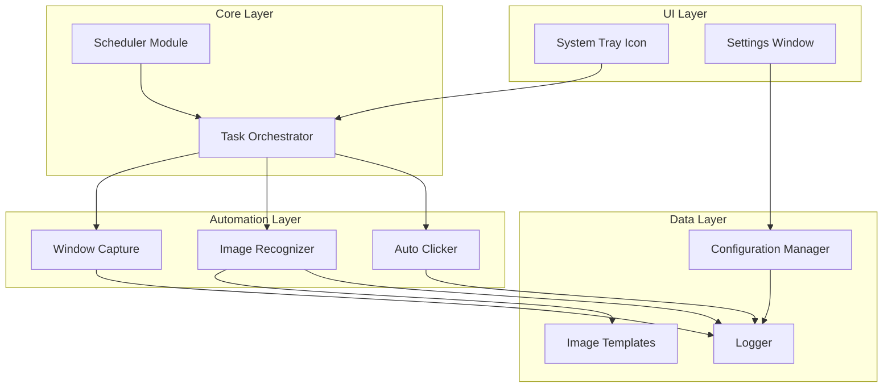
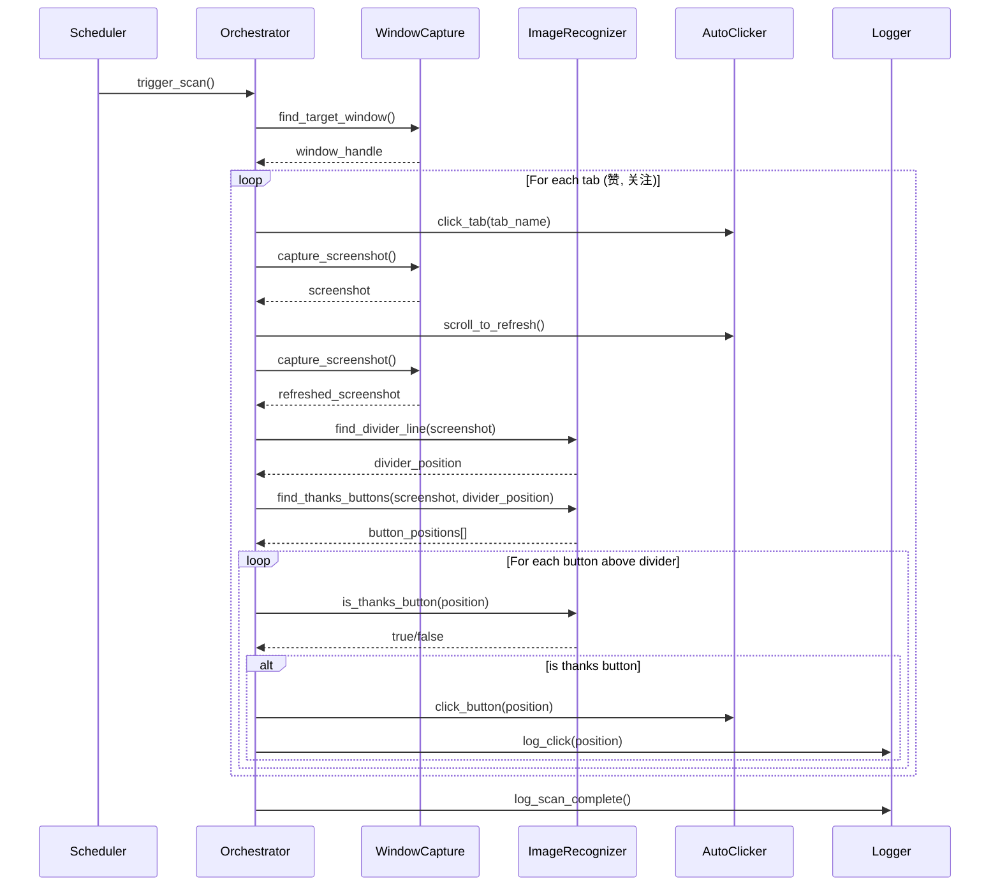

# Design Document: Auto Thanks Clicker

## Overview

本工具是一个 Windows 桌面自动化应用，使用 Python 开发，通过图像识别技术自动检测并点击"谢谢"按钮。核心技术栈包括：

- **OpenCV**: 图像模板匹配，用于识别"谢谢"、"已感谢"按钮和分界线
- **PyAutoGUI**: 屏幕截图和鼠标/键盘自动化操作
- **PyWin32**: Windows 窗口管理，定位和操作目标窗口
- **Pystray**: 系统托盘图标实现
- **APScheduler**: 定时任务调度

工具采用模块化设计，将窗口捕获、图像识别、自动点击、定时调度等功能分离为独立模块，便于维护和扩展。

## Architecture



### 执行流程



## Components and Interfaces

### 1. WindowCapture 模块

负责定位目标窗口并捕获截图。

```python
class WindowCapture:
    """窗口捕获模块，负责定位和截图目标窗口"""
    
    def __init__(self, window_title: str):
        """
        初始化窗口捕获器
        
        Args:
            window_title: 目标窗口标题（支持部分匹配）
        """
        pass
    
    def find_window(self) -> Optional[int]:
        """
        查找目标窗口
        
        Returns:
            窗口句柄 (HWND)，未找到返回 None
        """
        pass
    
    def get_window_rect(self) -> Optional[Tuple[int, int, int, int]]:
        """
        获取窗口位置和大小
        
        Returns:
            (left, top, right, bottom) 元组，窗口不存在返回 None
        """
        pass
    
    def capture_screenshot(self) -> Optional[np.ndarray]:
        """
        捕获窗口截图
        
        Returns:
            OpenCV 格式的图像数组 (BGR)，失败返回 None
        """
        pass
    
    def is_window_visible(self) -> bool:
        """检查窗口是否可见"""
        pass
    
    def bring_to_front(self) -> bool:
        """将窗口置于前台"""
        pass
```

### 2. ImageRecognizer 模块

负责图像模板匹配和元素识别。

```python
@dataclass
class MatchResult:
    """模板匹配结果"""
    x: int              # 中心点 X 坐标
    y: int              # 中心点 Y 坐标
    width: int          # 匹配区域宽度
    height: int         # 匹配区域高度
    confidence: float   # 匹配置信度
    template_name: str  # 模板名称

class ImageRecognizer:
    """图像识别模块，使用模板匹配识别UI元素"""
    
    def __init__(self, templates_dir: str, confidence_threshold: float = 0.8):
        """
        初始化图像识别器
        
        Args:
            templates_dir: 模板图片目录路径
            confidence_threshold: 匹配置信度阈值 (0.0-1.0)
        """
        pass
    
    def load_templates(self) -> Dict[str, np.ndarray]:
        """
        加载所有模板图片
        
        Returns:
            模板名称到图像数组的映射
        """
        pass
    
    def find_template(self, screenshot: np.ndarray, template_name: str) -> List[MatchResult]:
        """
        在截图中查找指定模板
        
        Args:
            screenshot: 截图图像
            template_name: 模板名称
            
        Returns:
            所有匹配结果列表
        """
        pass
    
    def find_thanks_buttons(self, screenshot: np.ndarray) -> List[MatchResult]:
        """
        查找所有"谢谢"按钮
        
        Returns:
            谢谢按钮的匹配结果列表
        """
        pass
    
    def find_thanked_buttons(self, screenshot: np.ndarray) -> List[MatchResult]:
        """
        查找所有"已感谢"按钮
        
        Returns:
            已感谢按钮的匹配结果列表
        """
        pass
    
    def find_divider_line(self, screenshot: np.ndarray) -> Optional[int]:
        """
        查找分界线位置
        
        Returns:
            分界线的 Y 坐标，未找到返回 None
        """
        pass
    
    def find_tab_buttons(self, screenshot: np.ndarray) -> Dict[str, MatchResult]:
        """
        查找标签页按钮（赞、关注）
        
        Returns:
            标签名称到匹配结果的映射
        """
        pass
    
    def filter_buttons_above_divider(
        self, 
        buttons: List[MatchResult], 
        divider_y: Optional[int]
    ) -> List[MatchResult]:
        """
        过滤出分界线上方的按钮
        
        Args:
            buttons: 按钮列表
            divider_y: 分界线 Y 坐标
            
        Returns:
            分界线上方的按钮列表
        """
        pass
```

### 3. AutoClicker 模块

负责模拟鼠标操作。

```python
class AutoClicker:
    """自动点击模块，模拟鼠标操作"""
    
    def __init__(self, click_delay: float = 0.5, scroll_amount: int = 3):
        """
        初始化自动点击器
        
        Args:
            click_delay: 点击之间的延迟（秒）
            scroll_amount: 每次滚动的行数
        """
        pass
    
    def click_at(self, x: int, y: int) -> bool:
        """
        在指定位置点击
        
        Args:
            x: 屏幕 X 坐标
            y: 屏幕 Y 坐标
            
        Returns:
            点击是否成功
        """
        pass
    
    def click_button(self, match: MatchResult, window_offset: Tuple[int, int]) -> bool:
        """
        点击匹配到的按钮
        
        Args:
            match: 匹配结果
            window_offset: 窗口左上角偏移 (x, y)
            
        Returns:
            点击是否成功
        """
        pass
    
    def scroll_down(self, x: int, y: int, amount: int = 3) -> None:
        """
        在指定位置向下滚动
        
        Args:
            x: 滚动位置 X 坐标
            y: 滚动位置 Y 坐标
            amount: 滚动行数
        """
        pass
    
    def scroll_up(self, x: int, y: int, amount: int = 3) -> None:
        """
        在指定位置向上滚动（用于刷新）
        """
        pass
```

### 4. TaskOrchestrator 模块

协调各模块完成自动感谢任务。

```python
@dataclass
class ScanResult:
    """扫描结果"""
    scan_time: datetime
    tabs_checked: List[str]
    buttons_found: int
    buttons_clicked: int
    errors: List[str]

class TaskOrchestrator:
    """任务协调器，协调各模块完成自动感谢任务"""
    
    def __init__(
        self,
        window_capture: WindowCapture,
        image_recognizer: ImageRecognizer,
        auto_clicker: AutoClicker,
        config: Config
    ):
        pass
    
    def run_scan_cycle(self) -> ScanResult:
        """
        执行一次完整的扫描和点击循环
        
        Returns:
            扫描结果
        """
        pass
    
    def process_tab(self, tab_name: str) -> Tuple[int, int]:
        """
        处理单个标签页
        
        Args:
            tab_name: 标签名称（"赞" 或 "关注"）
            
        Returns:
            (找到的按钮数, 点击的按钮数)
        """
        pass
    
    def refresh_content(self) -> None:
        """通过滚动刷新内容"""
        pass
```

### 5. Scheduler 模块

定时任务调度。

```python
class TaskScheduler:
    """定时任务调度器"""
    
    def __init__(self, orchestrator: TaskOrchestrator, interval_minutes: int = 60):
        """
        初始化调度器
        
        Args:
            orchestrator: 任务协调器
            interval_minutes: 检查间隔（分钟）
        """
        pass
    
    def start(self) -> None:
        """启动定时任务"""
        pass
    
    def stop(self) -> None:
        """停止定时任务"""
        pass
    
    def run_now(self) -> ScanResult:
        """立即执行一次扫描"""
        pass
    
    def set_interval(self, minutes: int) -> None:
        """设置检查间隔"""
        pass
    
    def is_running(self) -> bool:
        """检查调度器是否运行中"""
        pass
```

### 6. ConfigManager 模块

配置管理。

```python
@dataclass
class Config:
    """应用配置"""
    window_title: str = ""           # 目标窗口标题
    check_interval: int = 60         # 检查间隔（分钟）
    scroll_count: int = 3            # 滚动次数
    click_delay: float = 0.5         # 点击延迟（秒）
    confidence_threshold: float = 0.8 # 匹配置信度
    templates_dir: str = "templates" # 模板目录
    log_file: str = "auto_thanks.log" # 日志文件

class ConfigManager:
    """配置管理器"""
    
    def __init__(self, config_path: str = "config.json"):
        pass
    
    def load(self) -> Config:
        """加载配置"""
        pass
    
    def save(self, config: Config) -> None:
        """保存配置"""
        pass
    
    def get_default_config(self) -> Config:
        """获取默认配置"""
        pass
```

### 7. TrayIcon 模块

系统托盘图标。

```python
class TrayIcon:
    """系统托盘图标"""
    
    def __init__(
        self,
        scheduler: TaskScheduler,
        config_manager: ConfigManager,
        on_settings_click: Callable
    ):
        pass
    
    def run(self) -> None:
        """运行托盘图标（阻塞）"""
        pass
    
    def stop(self) -> None:
        """停止托盘图标"""
        pass
    
    def show_notification(self, title: str, message: str) -> None:
        """显示通知"""
        pass
    
    def update_status(self, is_running: bool) -> None:
        """更新状态图标"""
        pass
```

## Data Models

### 配置文件格式 (config.json)

```json
{
    "window_title": "目标应用窗口标题",
    "check_interval": 60,
    "scroll_count": 3,
    "click_delay": 0.5,
    "confidence_threshold": 0.8,
    "templates_dir": "templates",
    "log_file": "auto_thanks.log"
}
```

### 模板图片目录结构

```
templates/
├── thanks_button.png      # "谢谢"按钮模板 [必需]
├── thanked_button.png     # "已感谢"按钮模板 [必需]
├── tab_likes.png          # "赞"标签模板 [必需]
├── tab_follows.png        # "关注"标签模板 [必需]
├── divider_line.png       # 分界线模板 [可选]
└── tab_indicator.png      # "+X"新消息指示器模板 [可选]
```

#### 模板分类说明

**必需模板** - 缺少任何一个将导致程序无法启动：
- `thanks_button.png`: 核心功能，用于识别需要点击的按钮
- `thanked_button.png`: 核心功能，用于避免重复点击已感谢的按钮
- `tab_likes.png`: 标签切换功能，用于定位"赞"标签
- `tab_follows.png`: 标签切换功能，用于定位"关注"标签

**可选模板** - 缺少时使用降级功能：
- `divider_line.png`: 用于识别"—以下是更早消息—"分界线
  - 缺少时：处理所有可见的"谢谢"按钮（符合需求 3.5）
- `tab_indicator.png`: 用于识别"+X"指示器（如"赞+1"）
  - 缺少时：按默认顺序处理标签，不进行优先级排序

**设计决策说明**：
1. 模板目录故意为空，因为模板需要用户根据自己的屏幕分辨率和DPI设置截图准备
2. 分界线设为可选是因为需求 3.5 明确规定了降级行为
3. 指示器设为可选是因为标签优先级是增强功能，不影响核心点击功能

### 日志格式

```
2026-01-09 10:00:00 INFO  [Scheduler] Starting scan cycle
2026-01-09 10:00:01 INFO  [WindowCapture] Found window: 目标应用 (hwnd=12345)
2026-01-09 10:00:02 INFO  [ImageRecognizer] Found 3 thanks buttons, divider at y=450
2026-01-09 10:00:02 INFO  [ImageRecognizer] 2 buttons above divider
2026-01-09 10:00:03 INFO  [AutoClicker] Clicked button at (150, 320)
2026-01-09 10:00:04 INFO  [AutoClicker] Clicked button at (150, 280)
2026-01-09 10:00:05 INFO  [Scheduler] Scan complete: 2 buttons clicked
```


## Correctness Properties

*A property is a characteristic or behavior that should hold true across all valid executions of a system—essentially, a formal statement about what the system should do. Properties serve as the bridge between human-readable specifications and machine-verifiable correctness guarantees.*

### Property 1: Window Finding Correctness

*For any* window title string that matches an existing window, the `find_window` function SHALL return a valid window handle (non-None integer). *For any* window title that does not match any existing window, the function SHALL return None.

**Validates: Requirements 1.1, 1.3**

### Property 2: Screenshot Dimension Consistency

*For any* valid window handle, the captured screenshot dimensions (width, height) SHALL match the window's client area dimensions as reported by `get_window_rect`.

**Validates: Requirements 1.2**

### Property 3: Template Matching Completeness

*For any* screenshot image containing N instances of a template image at positions P1...Pn, the `find_template` function SHALL return exactly N match results, each with coordinates within a tolerance of the actual positions.

**Validates: Requirements 3.1, 3.2**

### Property 4: Button Filtering by Divider Position

*For any* list of button match results and a divider Y coordinate, the `filter_buttons_above_divider` function SHALL return only buttons where `button.y < divider_y`. *For any* button in the filtered list, its Y coordinate SHALL be strictly less than the divider Y coordinate.

**Validates: Requirements 3.3, 3.5**

### Property 5: Thanks vs Thanked Button Classification

*For any* screenshot, the intersection of `find_thanks_buttons` results and `find_thanked_buttons` results SHALL be empty (no button is classified as both). The click target list SHALL contain only results from `find_thanks_buttons`, never from `find_thanked_buttons`.

**Validates: Requirements 3.4, 4.3**

### Property 6: Click Coordinate Calculation

*For any* match result with center (x, y) and window offset (ox, oy), the calculated screen click coordinate SHALL be (x + ox, y + oy). The click SHALL occur exactly once per button.

**Validates: Requirements 4.1, 4.4**

### Property 7: Scroll Position Bounds

*For any* window with bounds (left, top, right, bottom), all scroll operations SHALL have coordinates (x, y) where `left <= x <= right` and `top <= y <= bottom`.

**Validates: Requirements 5.2**

### Property 8: Interval Configuration Validation

*For any* interval value V provided to the scheduler:
- If V < 5, the effective interval SHALL be 5 minutes
- If V > 1440 (24 hours), the effective interval SHALL be 1440 minutes
- Otherwise, the effective interval SHALL be V minutes

**Validates: Requirements 6.2**

### Property 9: Configuration Round-Trip Consistency

*For any* valid Config object C, saving C to file and then loading from that file SHALL produce a Config object C' where all fields are equal: `C.window_title == C'.window_title`, `C.check_interval == C'.check_interval`, etc.

**Validates: Requirements 7.4**

## Error Handling

### 窗口相关错误

| 错误场景 | 处理方式 |
|---------|---------|
| 目标窗口未找到 | 记录警告日志，等待下一个调度周期重试 |
| 窗口被最小化 | 等待窗口恢复可见状态，设置超时时间 |
| 窗口截图失败 | 记录错误日志，跳过当前周期 |
| 窗口位置获取失败 | 尝试重新查找窗口句柄 |

### 图像识别错误

| 错误场景 | 处理方式 |
|---------|---------|
| 模板文件不存在 | 启动时报错，提示用户准备模板图片 |
| 模板匹配无结果 | 正常情况，记录信息日志 |
| 匹配置信度过低 | 使用配置的阈值过滤，可调整阈值 |

### 点击操作错误

| 错误场景 | 处理方式 |
|---------|---------|
| 点击位置超出屏幕 | 跳过该按钮，记录警告 |
| 点击后状态未改变 | 记录警告，继续处理下一个按钮 |
| PyAutoGUI 操作失败 | 捕获异常，记录错误，继续执行 |

### 调度器错误

| 错误场景 | 处理方式 |
|---------|---------|
| 调度任务执行异常 | 捕获异常，记录错误，不影响下次调度 |
| 配置文件损坏 | 使用默认配置，记录警告 |

## Testing Strategy

### 测试框架选择

- **单元测试**: pytest
- **属性测试**: hypothesis (Python PBT 库)
- **模拟**: unittest.mock

### 单元测试覆盖

1. **WindowCapture 模块**
   - 测试窗口查找逻辑（使用 mock）
   - 测试窗口可见性检查
   - 测试截图尺寸计算

2. **ImageRecognizer 模块**
   - 测试模板加载
   - 测试模板匹配（使用预制测试图片）
   - 测试按钮过滤逻辑
   - 测试分界线检测

3. **AutoClicker 模块**
   - 测试坐标计算
   - 测试点击序列生成
   - 测试滚动参数

4. **ConfigManager 模块**
   - 测试配置加载/保存
   - 测试默认值处理
   - 测试无效配置处理

5. **TaskScheduler 模块**
   - 测试间隔验证
   - 测试启动/停止状态

### 属性测试覆盖

每个属性测试必须：
- 运行至少 100 次迭代
- 使用 hypothesis 生成随机输入
- 标注对应的设计文档属性编号

```python
# 示例：属性测试标注格式
@given(...)
def test_property_4_button_filtering(buttons, divider_y):
    """
    Feature: auto-thanks-clicker
    Property 4: Button Filtering by Divider Position
    Validates: Requirements 3.3, 3.5
    """
    # 测试实现
```

### 测试数据准备

1. **模板图片**: 准备标准的"谢谢"、"已感谢"、分界线模板
2. **测试截图**: 准备包含各种按钮组合的测试截图
3. **配置文件**: 准备有效和无效的配置文件样本

### 集成测试

- 测试完整的扫描周期流程（使用 mock 窗口）
- 测试调度器与协调器的集成
- 测试配置变更的实时生效
